# Digital Marketing Campaign Performance Analysis

A data-driven analysis of 10,000 digital marketing campaigns across 7 platforms, using exploratory analysis, statistical testing, regression, classification, and marketing analytics to identify the drivers of conversion, revenue, ROI, and campaign performance.

---

## Overview

This project evaluates the performance of **10,000 digital marketing campaigns** across **7 advertising platforms**, with approximately **$614.8M in advertising spend** generating **$1.77B in revenue**.

The objective was not simply to report campaign metrics, but to determine **what drives marketing performance and where budget, campaign, and optimization decisions should be focused**.

The analysis examines:

- Campaign and platform performance
- Revenue and ROI trends
- Conversion behavior
- Marketing funnel performance
- Campaign-type effectiveness
- Customer lifetime value (CLV)
- Device-level conversion patterns
- Relationships between key marketing KPIs
- Budget and revenue relationships
- Factors associated with campaign conversion
- A/B test performance
- Opportunities for budget optimization and campaign improvement

### Business Questions

The analysis was designed to answer five core business questions:

1. **Which platforms and campaign types generate the strongest business results?**
2. **What factors are associated with higher conversion and revenue?**
3. **Where are the largest performance gaps in the marketing funnel?**
4. **Which campaign characteristics provide evidence for better budget allocation?**
5. **What actions should marketing teams prioritize based on the evidence?**

---

## Dataset & Scope

The analysis covers **10,000 digital marketing campaigns** distributed across **7 advertising platforms**.

The dataset contains campaign-level information covering advertising investment, audience engagement, conversion activity, revenue generation, customer behavior, and campaign characteristics.

### Scope of Analysis

| Area | Coverage |
|------|----------|
| Campaigns | 10,000 |
| Advertising Platforms | 7 |
| Total Advertising Spend | ~$614.8M |
| Total Revenue | ~$1.77B |
| Analysis Period | August 2024 – October 2026 (2 years) |
| Primary Outcome Metrics | Revenue, Conversion, ROI, ROAS |
| Funnel Metrics | Impressions, Clicks, Sessions, Conversions |
| Customer Metrics | Customer Value and Segment Performance |
| Analytical Methods | EDA, Statistical Testing, Regression, Classification, A/B Testing |

### Core Marketing KPIs

The analysis focuses on the following performance measures:

- **CTR (Click-Through Rate):** Measures how effectively campaigns generate clicks from impressions.
- **CVR (Conversion Rate):** Measures the proportion of users who convert after interacting with the campaign.
- **CPA (Cost per Acquisition):** Measures the advertising cost associated with acquiring a customer.
- **ROAS (Return on Ad Spend):** Measures revenue generated relative to advertising spend.
- **ROI (Return on Investment):** Evaluates the return generated relative to the investment.
- **Revenue:** Measures the direct financial outcome generated by campaigns.
- **Customer Lifetime Value (CLV):** Estimates the longer-term economic value associated with customers.

These KPIs are evaluated together because no single metric provides a complete view of campaign effectiveness.

For example, a campaign can generate strong traffic while producing weak conversion performance, or generate high revenue while requiring disproportionately high advertising spend.

---

## Exploratory Data Analysis

The exploratory analysis examined campaign performance, customer behavior, conversion patterns, and revenue distribution to identify the major drivers of marketing performance.

### Campaign Performance Distribution

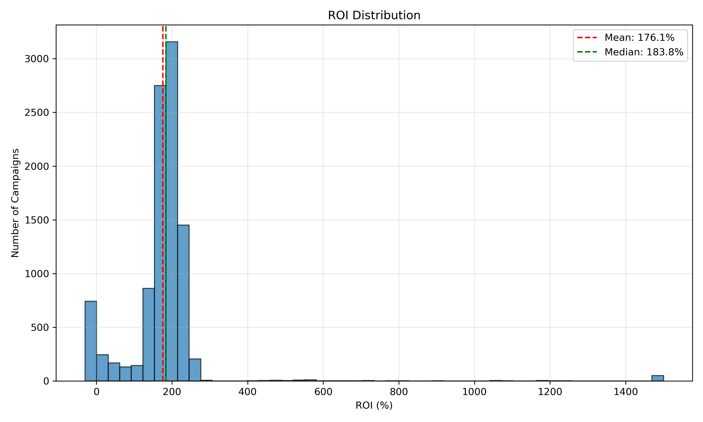

*Figure 1: Distribution of Campaign ROI*

The distribution shows how campaign returns vary across the portfolio, helping identify the concentration of high- and low-performing campaigns.

### Platform & Campaign-Type Performance

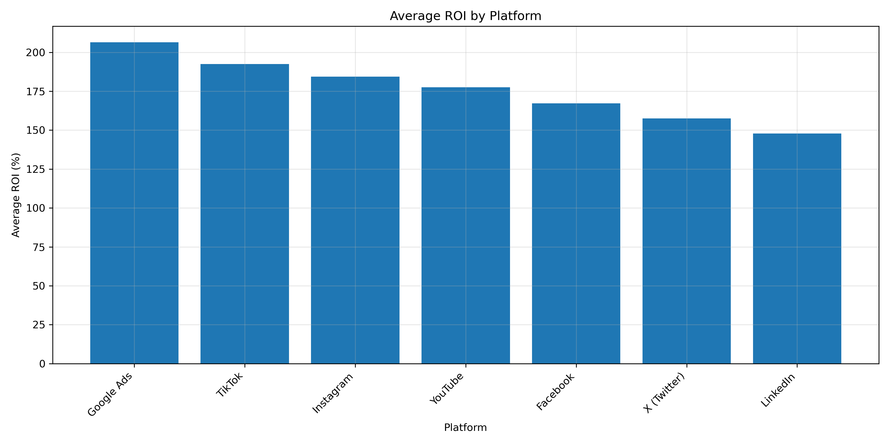

*Figure 2: Average ROI by Platform*

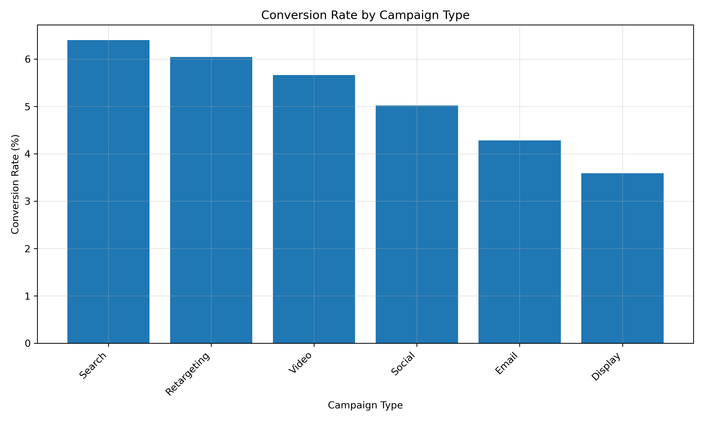

*Figure 3: Conversion Rate by Campaign Type*

Performance differs across both platforms and campaign types, indicating that campaign configuration should be considered alongside platform when allocating marketing resources.

### Funnel & Conversion Analysis

The funnel analysis examined how campaigns move users from engagement to conversion and where performance weakens across platforms and campaign types.

#### Overall Marketing Funnel

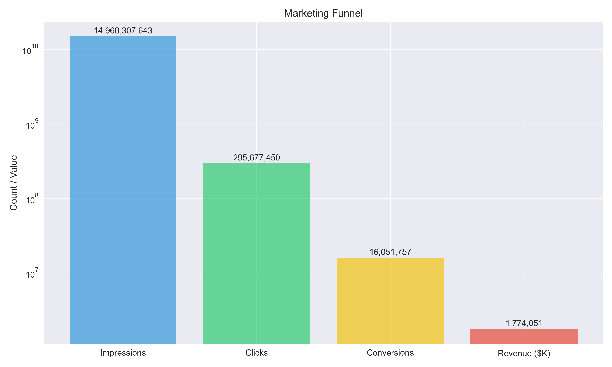

*Figure 4: Overall Marketing Funnel*

The overall funnel provides a portfolio-level view of engagement, progression, and conversion.

#### Funnel Performance by Platform

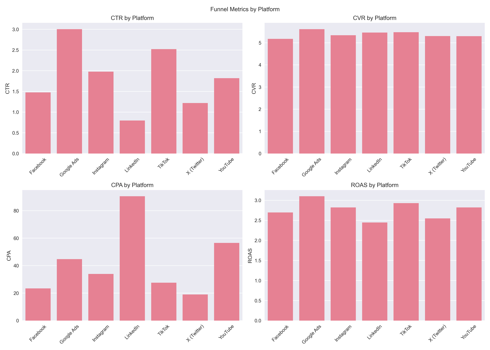

*Figure 5: Funnel Metrics by Platform*

The platform-level comparison highlights differences in where users drop off, helping identify channels that require creative, targeting, or landing-page improvements.

### Conversion by Campaign Type

Campaign type shows meaningful differences in conversion performance, supporting the broader finding that how a campaign is structured can matter more than the platform on which it runs.

### Customer & Revenue Analysis

Customer and revenue analysis was used to understand the commercial value generated by different campaign and customer segments.

#### Customer Lifetime Value by Segment

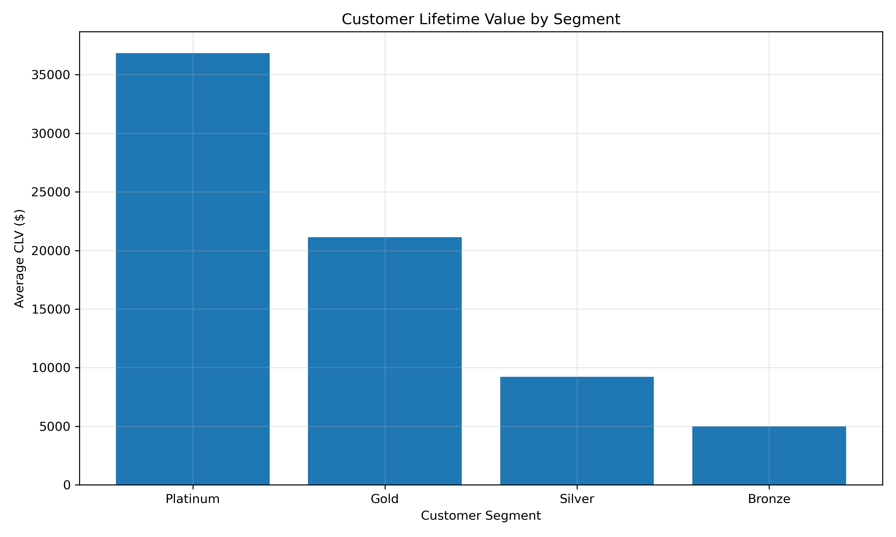

*Figure 6: Customer Lifetime Value by Segment*

Customer lifetime value varies across segments, providing an additional lens for evaluating campaign quality beyond immediate conversions.

#### Monthly Revenue Trend

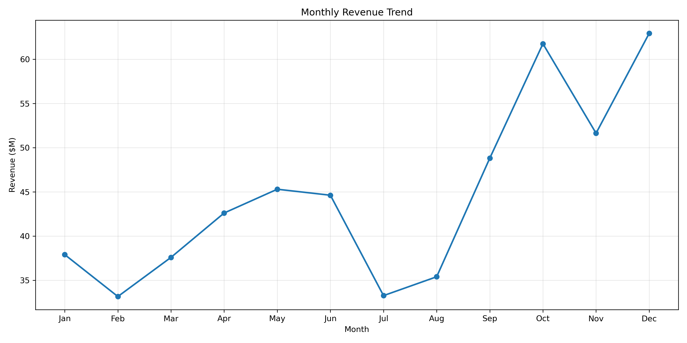

*Figure 7: Monthly Revenue Trend*

The monthly revenue trend provides context on performance over time and helps identify changes in campaign-generated revenue.

---

## Statistical Analysis

Statistical testing was used to determine whether observed differences in campaign performance were meaningful rather than simply the result of random variation.

### Hypothesis Testing Summary

| # | Hypothesis | Method | Result | Effect Size |
|---|------------|--------|--------|-------------|
| 1 | Google Ads ROI > LinkedIn ROI | Welch's t-test | p < 0.001 | d = 0.495 |
| 2 | Desktop > Mobile Conversion | Two-proportion z-test | p < 0.001 | +2.15 pp |
| 3 | Weekend vs Weekday Duration | Welch's t-test | p = 0.151 | — |
| 4 | Platform ROI Differences | One-Way ANOVA | p < 0.001 | η² = 0.021 |
| 5 | Campaign Type Conversion | One-Way ANOVA | p < 0.001 | η² = 0.651 |
| 6 | Segment CLV Differences | One-Way ANOVA | p < 0.001 | η² = 0.436 |
| 7 | Segment × Purchase Status | Chi-Square | p = 0.221 | V = 0.020 |
| 8 | A/B Test (B > A) | Two-proportion z-test | p < 0.001 | +24.0% lift |

### KPI Relationships

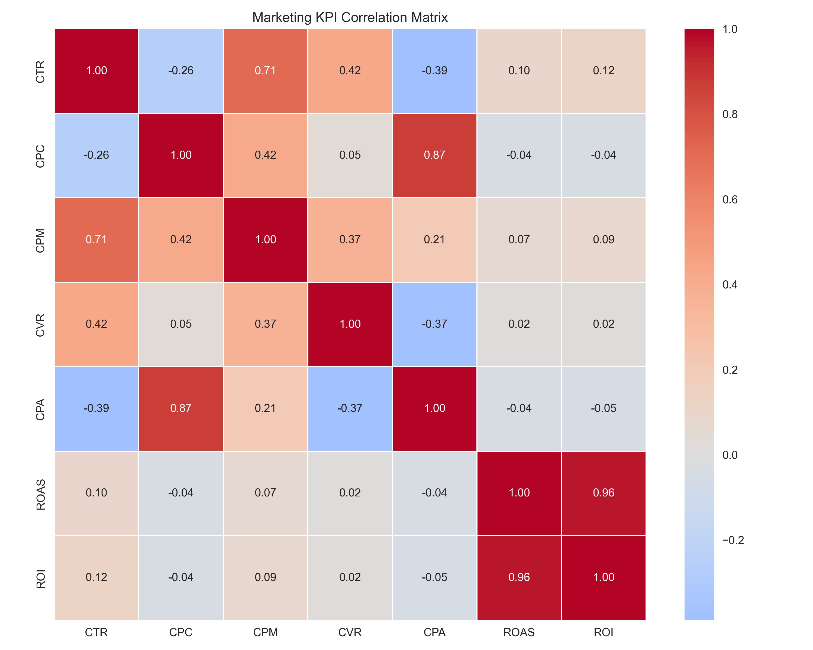

*Figure 8: KPI Correlation Matrix*

The correlation analysis examines relationships between key marketing metrics and helps identify which performance indicators tend to move together.

### A/B Test Results

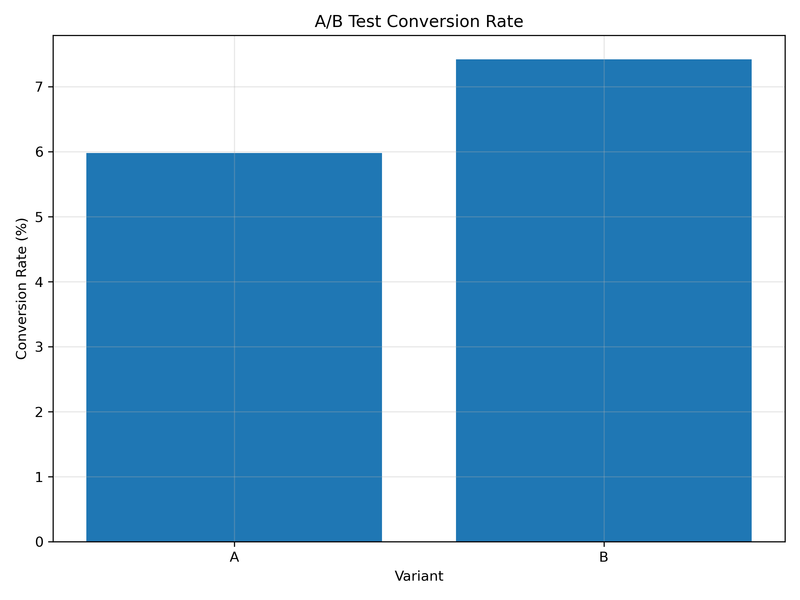

*Figure 9: A/B Test Results*

A/B testing was used to evaluate whether differences between campaign variants provided evidence of meaningful performance improvement.

---

## Regression & Predictive Analysis

Regression analysis was used to quantify relationships between marketing investment and business outcomes and to identify factors associated with campaign performance.

### Budget vs Revenue Regression

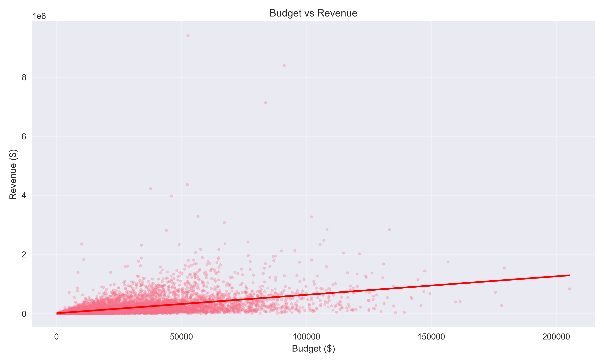

*Figure 10: Budget vs Revenue Regression*

The regression examines the relationship between campaign budget and revenue, providing evidence for evaluating budget allocation and potential scaling opportunities.

### Regression Model Summary

| Model | Target | R² / AUC | Key Insight |
|-------|--------|----------|-------------|
| 1 | Revenue (Budget) | 0.216 | Budget explains 21.6% of revenue |
| 2 | ROI | 0.022 | ROI is difficult to predict |
| 3 | Revenue (Pre-Campaign) | 0.437 | Pre-campaign variables explain 43.7% |
| 4 | Session → Conversion | 0.653 | Modest predictive power |

### Conversion Prediction

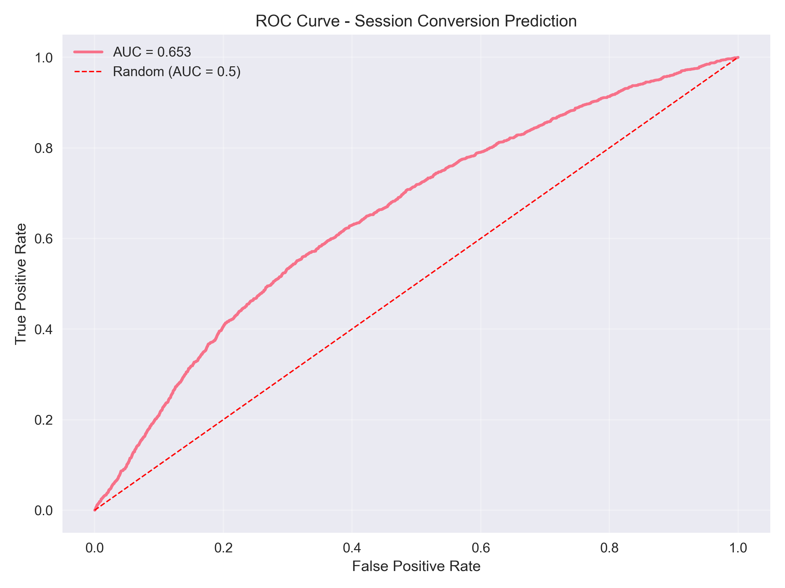

*Figure 11: Logistic Regression ROC Curve*

Logistic regression was used to evaluate the ability of campaign-level characteristics to distinguish between conversion outcomes.

---

## Marketing Performance Findings

The analysis translates the statistical and exploratory findings into practical marketing insights.

### 6.1 Platform Performance

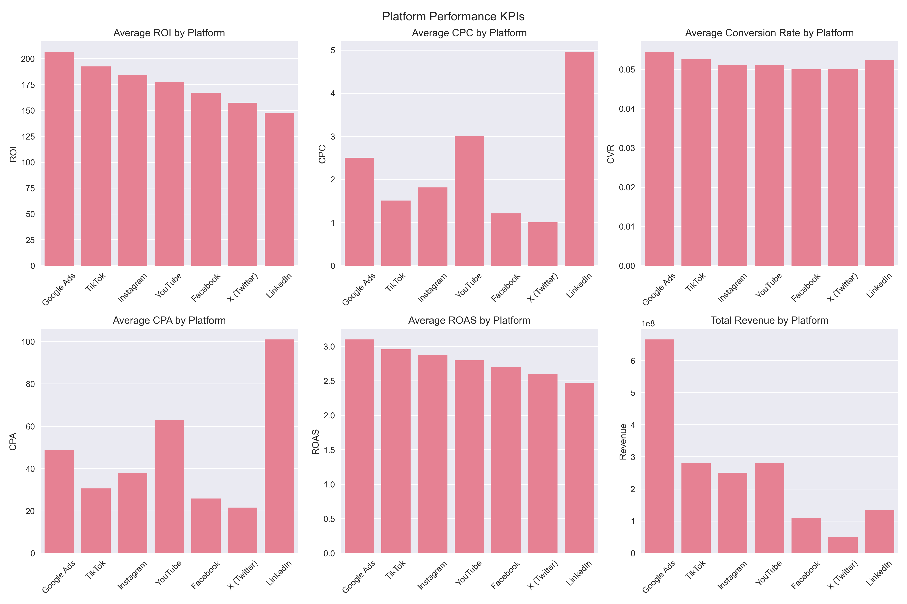

*Figure 12: Platform KPI Analysis*

Platform performance varies considerably, with differences in ROI, conversion efficiency, and other campaign KPIs.

### Campaign-Type Performance

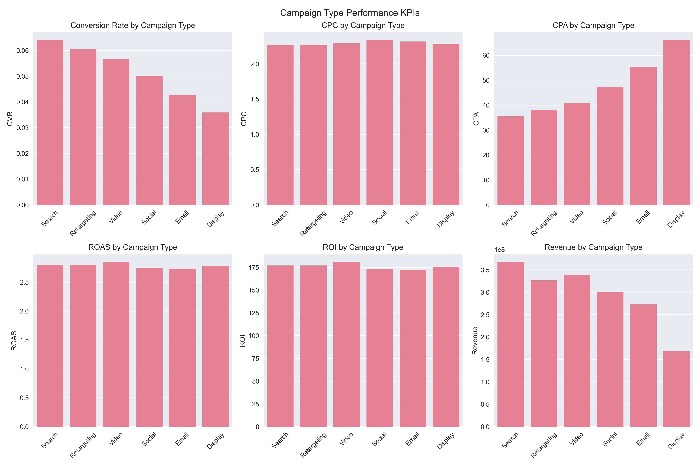

*Figure 13: Campaign Type KPI Analysis*

Campaign type provides another important layer of performance differentiation. The results indicate that budget decisions should not be made solely at the platform level.

### Device Conversion

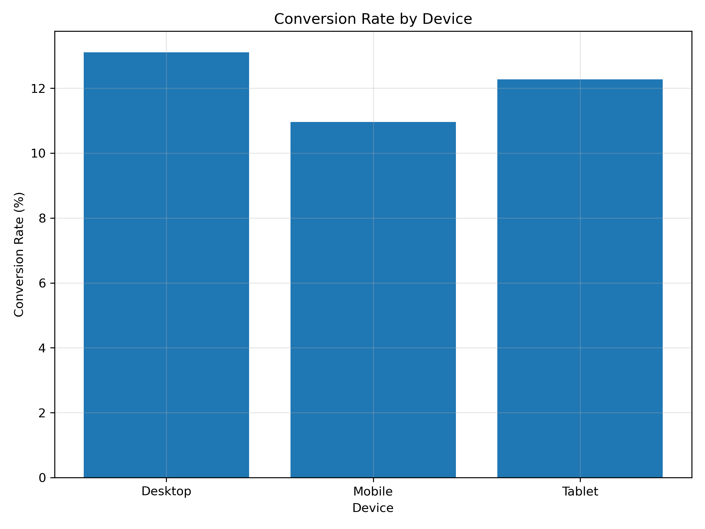

*Figure 14: Conversion Rate by Device*

Desktop conversion rates exceed mobile conversion rates, suggesting a potential mobile optimization opportunity.

### Key Marketing Findings

1. **Campaign structure is a major performance driver**, making campaign type an important consideration in budget allocation.
2. **Search campaigns demonstrate strong conversion efficiency**, creating an opportunity for controlled budget expansion.
3. **LinkedIn requires attention**, particularly because of its weaker CTR and higher acquisition cost relative to other platforms.
4. **Display campaigns show weaker conversion efficiency**, suggesting a need to improve the post-click experience and campaign execution.
5. **High-performing campaigns should be scaled progressively**, rather than assuming historical performance will remain constant at higher spending levels.
6. **Customer value should complement short-term campaign metrics** when evaluating marketing effectiveness.

---

## Business Recommendations

Based on the combined EDA, statistical analysis, regression results, and marketing performance analysis, the following actions are recommended.

### Campaign Decision Framework

| Decision | Campaigns | % | Action |
|----------|-----------|---|--------|
| Scale | 5,115 | 51.1% | Increase budget 10–20% staged |
| Optimize | 3,663 | 36.6% | Diagnose and fix funnel issues |
| Pause | 1,008 | 10.1% | Pause or redesign |
| Retarget | 214 | 2.1% | Launch retargeting program |

### Budget Allocation Recommendations

| Priority | Platform | Campaign Type | Recommended Change |
|----------|----------|---------------|-------------------:|
| 1 | Google Ads | Search | +20–30% |
| 2 | TikTok | Search | +15–25% |
| 3 | Google Ads | Video | +15–20% |
| 4 | LinkedIn | All | -30–40% |
| 5 | Display | All | -20–30% |

### Platform Strategy Summary

| Platform | ROI | Status | Recommendation |
|----------|-----|--------|----------------|
| Google Ads | 206.5% | Strong | Scale |
| TikTok | 192.5% | Strong | Scale Selectively |
| Instagram | 184.4% | Moderate | Optimize |
| YouTube | 177.6% | Moderate | Optimize |
| Facebook | 167.2% | Moderate | Optimize |
| X (Twitter) | 157.6% | Moderate | Optimize |
| LinkedIn | 147.8% | Weak | Redesign |

### Campaign-Type Strategy

| Campaign Type | CVR | CPA | Recommendation |
|---------------|-----|-----|----------------|
| Search | 6.40% | $35.50 | Scale |
| Retargeting | 6.04% | $37.93 | Scale |
| Video | 5.66% | $40.82 | Optimize |
| Social | 5.02% | $47.14 | Optimize |
| Email | 4.28% | $55.41 | Optimize |
| Display | 3.59% | $66.07 | Reduce/Redesign |

### Specific Actions

1. **Reallocate Budget Toward Proven Performers**

   Increase investment in campaigns and campaign types demonstrating strong conversion efficiency and return, using controlled budget increases and monitoring performance after each increment.

2. **Improve Underperforming Campaigns Before Increasing Spend**

   Campaigns with weak CTR, conversion rates, or acquisition efficiency should first be diagnosed and improved rather than receiving additional budget.

3. **Prioritize Campaign Type in Budget Decisions**

   Because campaign type explains a substantial share of conversion variation, marketing planning should evaluate platform × campaign type combinations, rather than treating each platform as a single performance category.

4. **Strengthen the Marketing Funnel**

   Use funnel performance to identify whether performance problems originate from:

   - Ad engagement → Click → Conversion

   This allows teams to apply the appropriate intervention instead of making broad platform-level changes.

5. **Use Testing as an Ongoing Process**

   Continue structured A/B testing across creative, messaging, landing pages, audiences, and bidding strategies. Winning variants should be scaled only after demonstrating statistically credible improvement.

6. **Incorporate Customer Value Into Campaign Evaluation**

   Campaign decisions should consider both immediate conversion performance and the longer-term value of customers acquired through each campaign or segment.

---

## Implementation Priorities

The recommendations can be translated into three practical stages:

| Priority | Focus | Action |
|----------|-------|--------|
| 1. **Protect** | Underperforming campaigns | Reduce, pause, or redesign campaigns that consistently fail performance thresholds |
| 2. **Optimize** | Existing campaigns | Improve creative, targeting, landing pages, and bidding |
| 3. **Scale** | Proven performers | Increase budget gradually while monitoring incremental performance |

### 8.1 30/60/90-Day Implementation Plan

| Period | Action | Expected Impact |
|--------|--------|-----------------|
| **First 30 Days** | Pause 1,008 campaigns, scale top 100 campaigns | +10–20% ROI |
| **Days 31-90** | Launch retargeting, optimize Display landing pages | +5–15% conversions |
| **Months 4-6** | Ongoing A/B testing, full budget reallocation | +15–25% revenue |

The objective is not simply to spend more on the best-performing campaigns, but to continuously improve the allocation of marketing resources based on measurable evidence.

---

## Conclusion

This analysis demonstrates how campaign-level data can be used to connect marketing activity with measurable business outcomes.

The findings show meaningful differences across platforms, campaign types, conversion performance, customer value, and revenue generation. Statistical and regression analysis provide additional evidence for distinguishing genuine performance patterns from simple variation in the data.

### The central business implication is clear:

> **Marketing budget should be allocated based on demonstrated campaign effectiveness, not platform popularity alone.**

A disciplined approach combining performance measurement, statistical validation, funnel analysis, customer value, experimentation, and controlled budget allocation can help improve marketing efficiency while creating a stronger foundation for future campaign decisions.

### Final Summary of Key Metrics

| Metric | Value |
|--------|-------|
| Total Campaigns | 10,000 |
| Total Spend | $614.8M |
| Total Revenue | $1.77B |
| Average ROI | 176.1% |
| Google Ads ROI | 206.5% |
| Search Campaign CVR | 6.40% |
| Scale Campaigns | 5,115 |
| A/B Test Lift | +24.0% |
